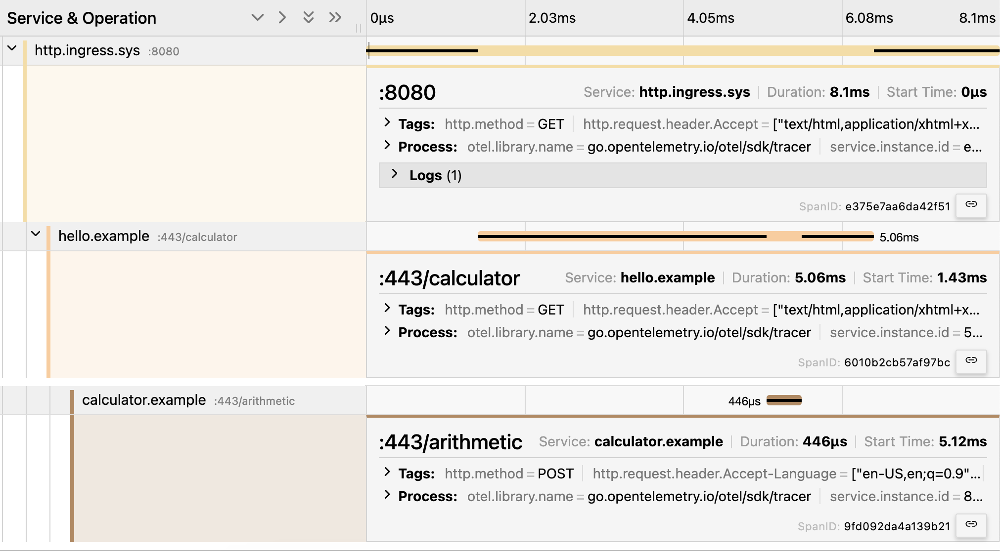
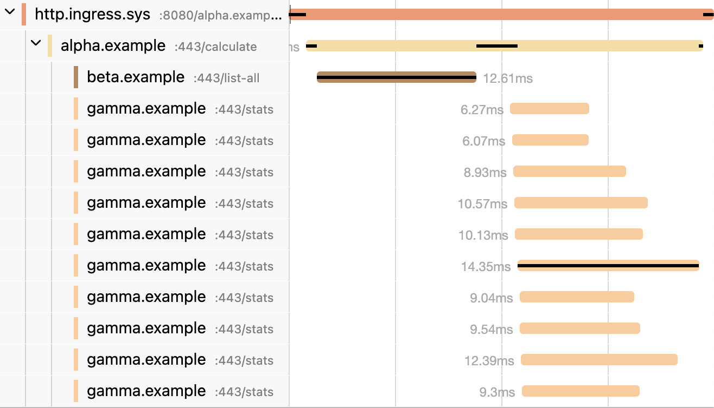

# Distributed Tracing

Distributed tracing enables the visualization of the flow of function calls across microservices and processes. Without distributed tracing, it's extremely challenging to troubleshoot a distributed system.
`Microbus` leverages [Jaeger](https://www.jaegertracing.io) and [OpenTelemetry](https://opentelemetry.io) to automatically create and collect tracing spans for executions of endpoints, [tickers](../blocks/tickers.md) and callbacks of all microservices and visualize them as a single stack trace.

## Configuration

`Microbus` exports tracing spans via the OTLP HTTP collector. The `OTEL_EXPORTER_OTLP_TRACES_ENDPOINT` or the `OTEL_EXPORTER_OTLP_ENDPOINT` [environment variables](../tech/envars.md) may be used to configure the collector's endpoint.

Whether or not a trace is exported to the collector depends on the [deployment environment](../tech/deployments.md) of the microservice:

- In `LOCAL`, `TESTING` and `LAB` deployments, all traces are exported to the collector
- In `PROD` deployments, only traces that contain at least one error span, or those that are otherwise explicitly selected using `svc.ForceTrace`, are exported to the collector

## Example

Here's a Jaeger visualization of a fictitious microservice `alpha` using the notorious N+1 anti-pattern. One can easily spot the serialized nature of the code. It took 115ms to complete.

```go
func (svc *Service) Calculate(ctx context.Context) (sigma float64, err error) {
	keys, _ := betaapi.NewClient(svc).ListAll(ctx)
	var amounts []float64
	for k := range keys {
		stats, _ := gammaapi.NewClient(svc).Stats(ctx, keys[k])
		amounts = append(amounts, stats.Amount)
	}
	return svc.stdDeviation(amounts), nil
}
```


<p></p>

And here's the same function rewritten to perform the N operations in parallel. It completed in 33ms, almost a 4x improvement.

```go
func (svc *Service) Calculate(ctx context.Context) (sigma float64, err error) {
	keys, _ := betaapi.NewClient(svc).ListAll(ctx)
	amounts := make([]float64, len(keys))
	jobs := []func() error{}
	for k := range keys {
		k := k
		jobs = append(jobs, func() error {
			stats, _ := gammaapi.NewClient(svc).Stats(ctx, keys[k])
			amounts[k] = stats.Amount
			return nil
		})
	}
	_ = svc.Parallel(jobs...)
	return svc.stdDeviation(amounts), nil
}
```


<p></p>
