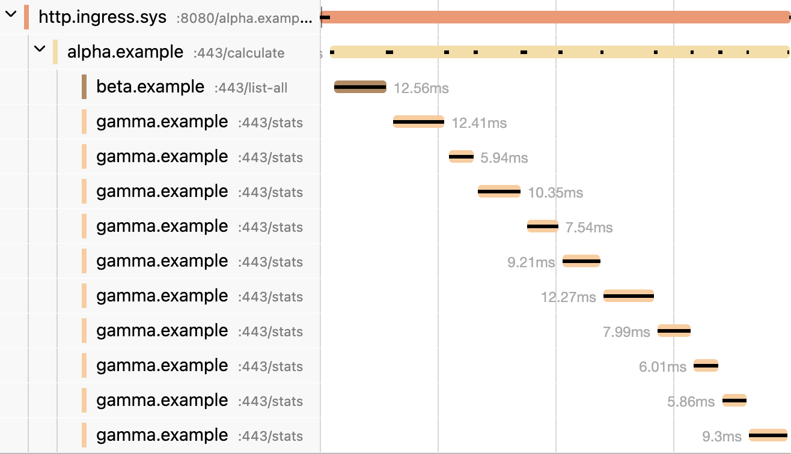

# Distributed Tracing

Distributed tracing enables the visualization of the flow of function calls across microservices and processes. Without distributed tracing, it's extremely difficult to understand the flow of calls across microservices and to troubleshoot a distributed system.
`Microbus` leverages [Jaeger](https://www.jaegertracing.io) and [OpenTelemetry](https://opentelemetry.io) to automatically create and collect tracing spans for executions of endpoints, tickers and callbacks of all microservices and visualize them as a single stack trace.

`Microbus` exports tracing spans via the OTLP HTTP collector. The `OTEL_EXPORTER_OTLP_TRACES_ENDPOINT` or the `OTEL_EXPORTER_OTLP_ENDPOINT` [environment variables](../tech/envars.md) may be used to configure the collector's endpoint.

Whether or not a trace is exported to the collector depends on the [deployment environment](../tech/deployments.md) of the microservice:

- In `LOCAL`, `TESTING` and `LAB` deployments, all traces are exported to the collector
- In `PROD` deployments, only traces that contain at least one error span, or those that are otherwise explicitly selected using `svc.ForceTrace`, are exported to the collector
