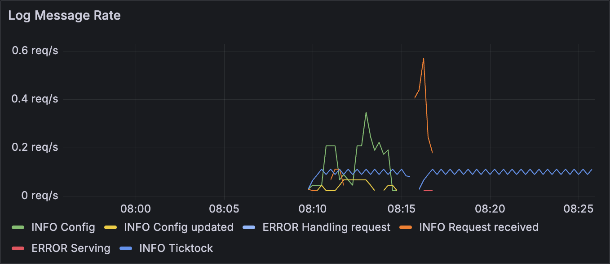

# Metrics

Good observability is crucial when operating a SaaS system because it's not possible to debug it live. Alongside [structured logging](../blocks/logging.md) and [distributed tracing](../blocks/distrib-tracing.md), metrics are one of the pillars of observability.

In `Microbus`, metrics are collected by the [metrics core microservice](../structure/coreservices-metrics.md), shipped to [Prometheus](https://prometheus.io), then visualized with [Grafana](https://grafana.com) dashboards. 


<p></p>

### Standard Metrics

By default, all microservices produce a standard set of metrics:

* The microservice's uptime
* Histogram of the execution time of callbacks such as `OnStartup`, `OnShutdown`, tickers, etc.
* Histogram of the processing time of incoming requests
* Histogram of the size of the response to incoming requests
* Count of the result of outgoing requests
* Histogram of time to receive an acknowledgement from a downstream microservice
* Count of log messages recorded
* Count of distributed cache hits and misses
* Total weight of the distributed cache

### Custom Metrics

Custom metrics may be defined using the `Connector`'s `DefineCounter`, `DefineGauge` or `DefineHistorgram`. Metrics are incremented or observed using  `IncrementMetric` or `ObserveMetric`, depending on their type. The Prometheus [collector types](https://prometheus.io/docs/concepts/metric_types/) currently supported are `Counter`, `Gauge`, and `Histogram`. The `Summary` collector type is not supported.

| Type | Increment | Observe |
|---|---|---|
| Counter | Yes | No |
| Gauge | Yes | Yes |
| Histogram | No | Yes |

[Code generation](../blocks/codegen.md) can be used to assist in the definition of metrics.

```yaml
# Metrics
#
# signature - Func(measure Type, label Type, label Type)
#	 RequestDurationSeconds(dur time.Duration, method string, success bool)
#	 MemoryUsageBytes(b int64)
#	 DistanceMiles(miles float64, countryCode int)
#	 RequestsCount(count int, domain string) - unit-less accumulating count
#	 CPUSecondsTotal(dur time.Duration) - accumulating count with unit
#	 See https://prometheus.io/docs/practices/naming/ for naming best practices
# description - Documentation
# kind - The kind of the metric, "counter" (default), "gauge" or "histogram"
# buckets - Bucket boundaries for histograms [x,y,z,...]
# alias - The name of the metric in Prometheus (defaults to package+function in snake_case)
metrics:
  - signature: Likes(num int, postId string)
    description: Likes counts the number of likes for a given post.
    kind: counter
    alias: myapp_message_post_number_of_likes
```

Follow the recommended [best practices](https://prometheus.io/docs/practices/naming/) when naming aliases.

### Usage in Code

`IncrementLikes` would be created by the code generator based on the `service.yaml` example above.

```go
func (svc *Intermediate) IncrementLikes(num int, postId string) error {
	// ...
}
```

It can then be used to count the number of likes in the relevant endpoint.

```go
func (svc *Service) MyEndpoint() error {
	// ...

	// A like has been registered and we want this reflected in Prometheus.
	err := svc.IncrementLikes(1, postId)
	if err != nil {
		return errors.Trace(err)
	}
	return nil
}
```
