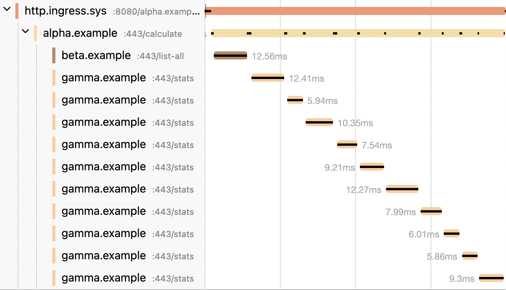
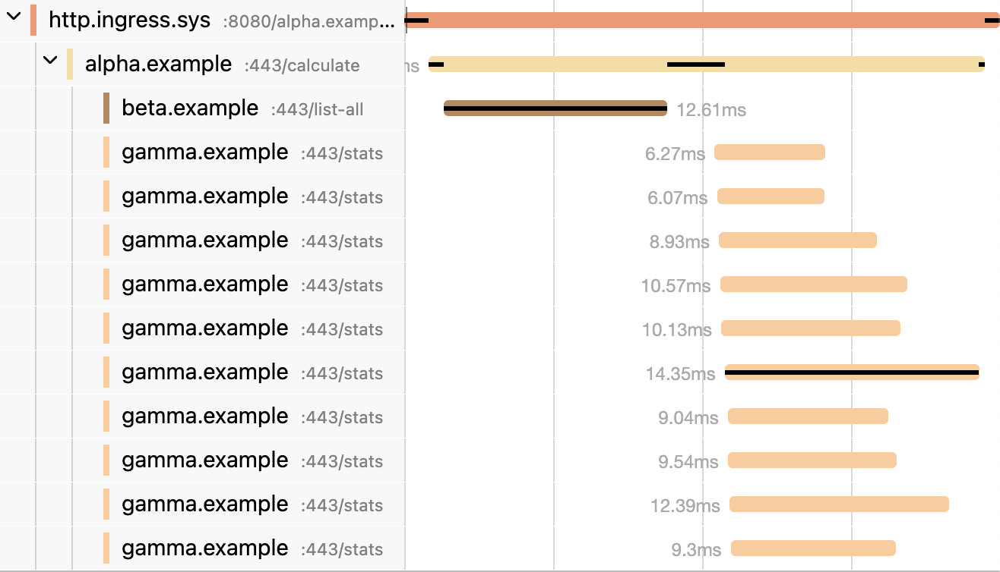

# Elevated Engineering Experience

The ultimate goal of building an application is delivering value to the customer. The faster the engineering team can move, the greater than value. As such, `Microbus` aims first and foremost to elevate the engineering experience. It introduces RAD tools that take care of much of the mundane boilerplate work, freeing engineers to focus on the higher-level concepts and the business value. 

`(Customer Value) = (Engineering Quality) x (Engineering Velocity)`

## Code Generation

In `Microbus`, everything starts with a `service.yaml` file that semantically defines the microservice. A powerful [code generator](../blocks/codegen.md) then takes this definition and produces a code skeleton for the implementation of microservice itself, a client stub that is used by upstream microservices to call it, an integration test harness that helps to thoroughly test it along with its downstream dependencies, and an OpenAPI document that describes its API.


<p>

For applications that have a front-end built for example as a single-page application, the OpenAPI document streamlines communications with the front-end engineering team. It serves as the source of truth of the backend API and is always up to date with the latest back-end code.


<p>

Because of code generation all microservices share a [uniform code structure](../blocks/uniform-code.md). This helps engineers to get oriented quickly in the code even if they are not its original authors. Often a quick glace at `service.yaml` is worth reading a thousand lines of code. Engineers spend a majority of their time reading code so this is of huge value. It also means that engineers more portable anc cane move between teams with little training.

## Fully Local Development

In `Microbus`, microservices are not large memory-gobbling processes but rather compact worker goroutines that ultimately consume messages from a queue. Microservices also don’t listen on ports so there is no potential of a port conflict with other microservices. These two qualities allow `Microbus` to spin up a large multitude of microservices in a single executable, enabling engineers to run and debug an entire application in their IDE. In fact, starting or restarting an application takes only a second or two, allowing engineers to iterate on code change quickly. It is a huge productivity boost.

Those same qualities also allow `Microbus` to spin a microservice along with all its downstream dependencies inside a single application for testing purposes. Full-blown integration tests can then be run by `go test`, achieving a high-degree of code coverage.

The compact footprint of a `Microbus` application also enables a front-end team to run it locally rather than depend on a remote integration environment.

## Observability

`Microbus` instruments all microservice endpoints to capture distributed traces (OpenTelemetry), performance metrics and [errors](../blocks/error-capture.md). Engineers can observe the system with pinpoint accuracy either during development or in production. Visualizations by Jaeger and Grafana make troubleshooting and performance optimization a breeze.

Here's a Jaeger visualization of a fictitious microservice `alpha` using the notorious N+1 anti-pattern. One can easily spot the serialized nature of the code. It took 115ms to complete.

```go
func (svc *Service) Calculate(ctx context.Context) (sigma float64, err error) {
	keys, _ := betaapi.NewClient(svc).ListAll(ctx)
	var amounts []float64
	for k := range keys {
		stats, _ := gammaapi.NewClient(svc).Stats(ctx, keys[k])
		amounts = append(amounts, stats.Amount)
	}
	return svc.stdDeviation(amounts), nil
}
```


<p>

And here's the same function rewritten to perform the N operations in parallel. It completed in 33ms, almost a 4x improvement.

```go
func (svc *Service) Calculate(ctx context.Context) (sigma float64, err error) {
	keys, _ := betaapi.NewClient(svc).ListAll(ctx)
	amounts := make([]float64, len(keys))
	jobs := []func() error{}
	for k := range keys {
		k := k
		jobs = append(jobs, func() error {
			stats, _ := gammaapi.NewClient(svc).Stats(ctx, keys[k])
			amounts[k] = stats.Amount
			return nil
		})
	}
	_ = svc.Parallel(jobs...)
	return svc.stdDeviation(amounts), nil
}
```


<p>

## Best Practices

`Microbus`'s code generator drives a code structure that is aligned with the concepts of a modular monolith. Microservices are isolated behind a clear interface.

Guardrails and handholds guide engineers to avoid common pitfalls. These measures often work behind the scene and are not immediately obvious. For example, the API of a microservice is created in a distinct package from its implementation in order to avoid circular dependencies.

Various complex patterns are pre-built to make the engineer's life easier. For instance:

* A [distributed cache](../blocks/distrib-cache.md) that is scoped to each microservice individually 
* An inherent publish/subscribe communication pattern for an [event](../blocks/events.md)-driven architecture
* `connector.Go` runs code in a goroutine with a graceful shutdown attached to the lifespan of the microservice
* A simple to use `connector.Parallel` encourages running code in parallel
