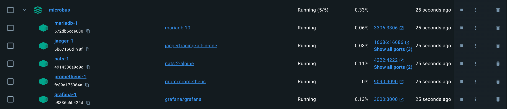

# Quick Start

## Clone the Project

Fetch the code:

```cmd
mkdir github.com/microbus-io
cd github.com/microbus-io
git clone https://github.com/microbus-io/fabric
```

## Setup and Run the Development Environment

The `Microbus` framework depends on a few third-party services:

* `NATS` is a hard requirement used as the communication transport between microservice
* `MariaDB` is needed for microservices that depend on it, such as the CRUD example
* `Prometheus` is an optional service that can be used to collect metrics from `Microbus` microservices
* `Grafana` is an optional service that can visualize metrics collected by `Prometheus`

Use `docker compose` from within the `setup` directory to install the above and set up the development environment.

```cmd
cd setup
docker compose -f microbus.yaml -p microbus up
```

`Docker Desktop` should now show the `microbus` application:



The `-DV` (debug and verbose) flags of `NATS` slow down `NATS` considerably and are therefore disabled in `microbus.yaml`. To run with these flags enabled, it's recommended to run `NATS` in a separate terminal window instead of inside `Docker`.

## Run the Examples

Run the example app:

```cmd
cd examples/main
go run main.go
```

It is necessary to set the working directory to `examples/main` so that the `examples/main/env.yaml` file is located.

If you're using Visual Studio Code, simply press `F5`. The `.vscode/launch.json` file includes a launch configuration for running `examples/main`.

Try the following URLs in your browser:

* http://localhost:8080/calculator.example/arithmetic?x=5&op=*&y=8
* http://localhost:8080/calculator.example/square?x=5
* http://localhost:8080/calculator.example/square?x=not-a-number
* http://localhost:8080/calculator.example/distance?p1.x=0&p1.y=0&p2.x=3&p2.y=4
* http://localhost:8080/hello.example/echo
* http://localhost:8080/hello.example/ping
* http://localhost:8080/hello.example/hello?name=Bella
* http://localhost:8080/hello.example/calculator
* http://localhost:8080/hello.example/bus.jpeg
* http://localhost:8080/messaging.example/home
* http://localhost:8080/messaging.example/cache-store?key=foo&value=bar
* http://localhost:8080/messaging.example/cache-load?key=foo

Feel free to experiment with different values for the query arguments.

To view the metrics collected by [`Prometheus`](https://prometheus.io), go to http://localhost:9090/graph. As an example, you may execute the query `microbus_uptime_duration_seconds_total`.

To view the same metrics in [`Grafana`](https://grafana.com/) dashboards, go to http://localhost:3000 and login using the credentials `admin`:`admin`.

## Configure IDE

The [Todo Tree extension](https://marketplace.visualstudio.com/items?itemName=Gruntfuggly.todo-tree) is recommended for VS Code users.
