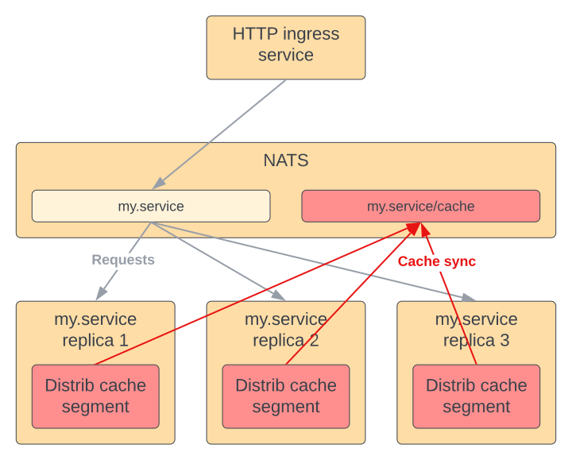
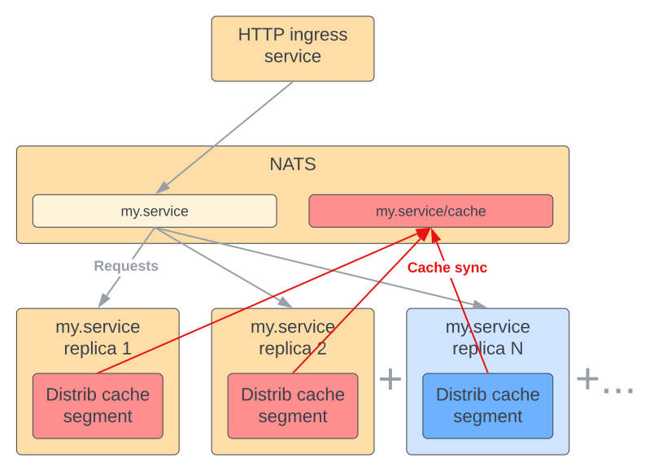
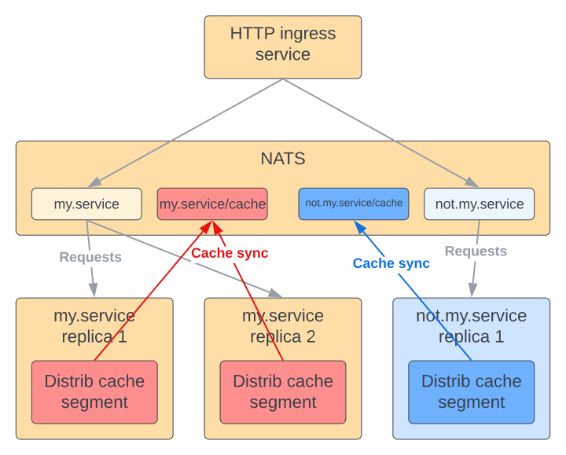
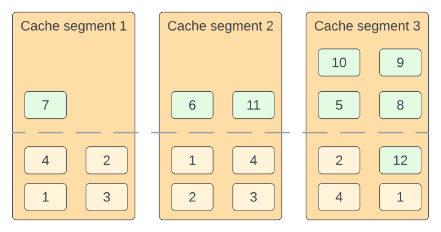
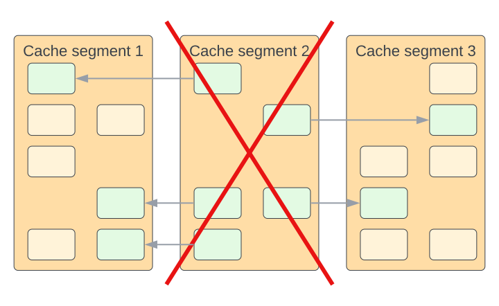

# Package `dlru`

The `dlru` package implements an [LRU cache](./lru.md) that is distributed among all peer replicas of a microservice. The cache uses pub/sub over NATS to communicate and synchronize.

The capacity of the cache scales linearly with the number of replicas of the microservice.

The cache is scoped to a single microservice, therefore isolating it from side-effects that can be caused by "noisy neighbor" microservices. Isolation also makes it possible to independently scale to the individual needs of each microservice.

Operations are synchronized over the network and the cache is not immune to race conditions. To help improve consistency, the `Load` operations checks with peers to ensure there are no multiple versions of the same element. This is still not a 100% guarantee of consistency.

Data can survive a clean shutdown of a microservice if there is at least one other replica running at that time that has enough capacity to hold its data.

Cached elements can get evicted for various reason and without warning. Cache only that which you can afford to lose and reconstruct from the original data source. A distributed cache is not shared memory. Do not use a distributed cache to share state among peers.
