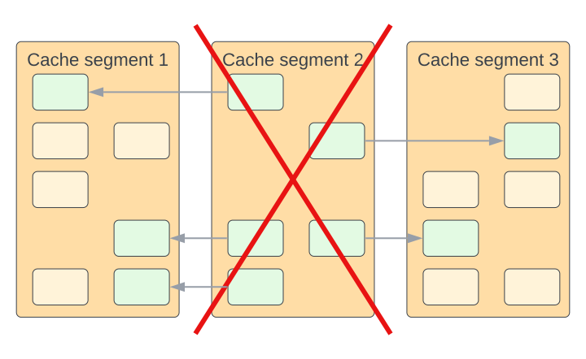

# Package `dlru`

The `dlru` package implements an [LRU cache](./lru.md) that is distributed among all peer replicas of a microservice. The cache uses pub/sub over NATS to communicate and synchronize.

The distributed cache exhibits important characteristics:

**Scalability** - The capacity of the cache scales linearly with the number of replicas.

**Isolation** - The cache is scoped to a single microservice, therefore isolating it from side-effects (such as the noisy neighbor problem) that can be caused by other microservices. It also enables independently scaling up to the individual needs of each microservice.

**Duplication** - When cache segments are less than half-full, elements may be inserted into more than one replica in order to speed up future lookups. When more than half-full, elements are inserted into only one replica. Over time, the unique elements evict the duplicated elements (see element `12` in the diagram) so this logic does not hurt capacity.

**Race conditions** - Operations are synchronized over the network and the cache is not immune to race conditions under certain conditions. To help improve consistency, the `Load` operations by default checks with peers and fails if it detects multiple versions of the same element. This is still not a 100% guarantee of consistency.

**Resilience** - Data can survive a clean shutdown of a microservice if there is at least one other replica running at that time that has enough capacity to hold its data.

**Volatile** - Cached elements can get evicted for various reason and without warning. Cache only that which you can afford to lose and reconstruct from the original data source. Do not use a distributed cache to share state among peers.
