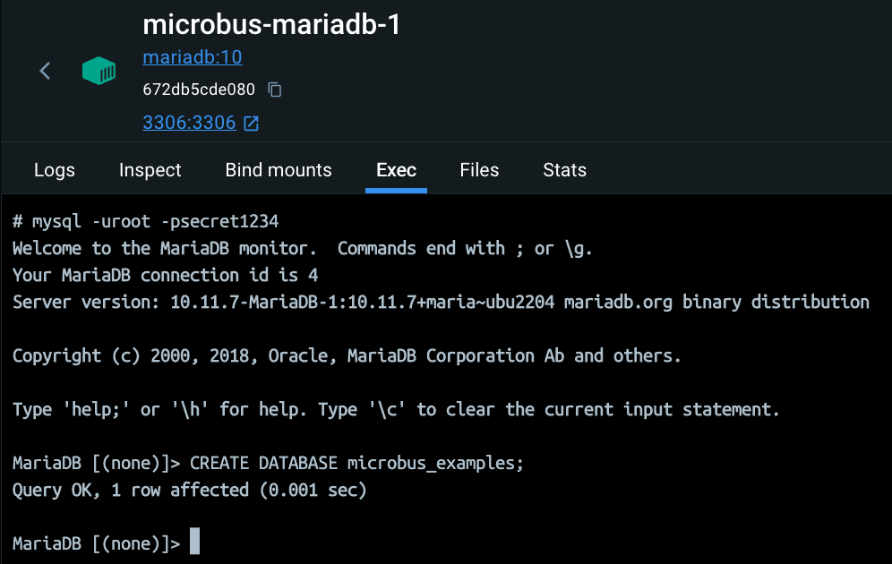
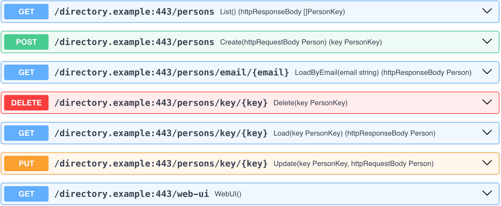

# Package `examples/directory`

The `directory.example` microservice is an example of a microservice that provides a RESTful CRUD API backed by a SQL database.
For the sake of this example, if a connection to the SQL database cannot be established, the microservice emulates a database in-memory.

## Adding SQL Support

It takes a couple of steps to add SQL support to a microservice.

Edit `service.yaml` to define a configuration property to represent the connection string.

```yaml
configs:
  - signature: SQL() (dsn string)
    description: SQL is the connection string to the database.
```

Then run `go generate` to create the `svc.SQL()` method corresponding to the `SQL` configuration property.

```cmd
go generate
```

Next, define the database connection `db *sql.DB` as a member property of the `Service`.

```go
import _ "github.com/go-sql-driver/mysql"

type Service struct {
	*intermediate.Intermediate // DO NOT REMOVE

	db *sql.DB
}
```

Open it in `OnStartup`.

```go
// OnStartup is called when the microservice is started up.
func (svc *Service) OnStartup(ctx context.Context) (err error) {
	dsn := svc.SQL()
	if dsn != "" {
		svc.db, err = sql.Open("mysql", dsn)
		if err == nil {
			err = svc.db.PingContext(ctx)
		}
		if err != nil {
			return errors.Trace(err)
		}
	}
	return nil
}
```

And close it in `OnShutdown`.

```go
// OnShutdown is called when the microservice is shut down.
func (svc *Service) OnShutdown(ctx context.Context) (err error) {
	if svc.db != nil {
		svc.db.Close()
		svc.db = nil
	}
	return nil
}
```

## Connecting to the Database

This example requires a MariaDB database instance. If you don't already have one installed, you can add it to Docker using:

```cmd
docker pull mariadb
docker run -p 3306:3306 --name mariadb-1 -e MARIADB_ROOT_PASSWORD=secret1234 -d mariadb
```

Next, create a database named `microbus_examples`.

From the `Exec` panel of the `mariadb-1` container, type:

```cmd
mysql -uroot -psecret1234
```

And then use the SQL command prompt to create the database:

```sql
CREATE DATABASE microbus_examples;
```


<p></p>

The connection string to the database is pulled from `main/config.yaml` by the [configurator](./coreservices-configurator.md) and served to the `directory.example` microservice. Adjust it as necessary to point to the location of your MariaDB database.

```yaml
directory.example:
  SQL: "root:secret1234@tcp(127.0.0.1:3306)/microbus_examples"
```

## Web UI

The directory microservice uses a RESTful API style rather than RPC over JSON. A RESTful API leverage HTTP methods other than just `GET`, which are impossible to call directly from the browser's address bar. To circumvent this restriction, the microservice includes a web endpoint called `WebUI` that provides a simple browser-like form that supports `GET`, `POST`, `PUT` and `DELETE`.

Open the web UI at http://localhost:8080/directory.example/web-ui

To create a new person in the directory `POST` to `/persons`:

```json
{
    "email": "harry.potter@hogwarts.edu.wiz",
    "firstName": "Harry",
    "lastName": "Potter"
}
```

The server will respond with the new user's key:

```json
{
    "key": 1
}
```

Oops, we forgot to enter Harry's birthday! To update a record `PUT` to `/persons/key/1` (assuming that key 1 was assigned to Harry):

```json
{
    "email": "harry.potter@hogwarts.edu.wiz",
    "firstName": "Harry",
    "lastName": "Potter",
    "birthday": "1980-07-31"
}
```

To list all persons in the directory `GET` from `/persons`. The server will respond with an array of keys:

```json
[
    1
]
```

To load a record, `GET` from `/persons/key/1` (by key) or `/persons/email/harry.potter@hogwarts.edu.wiz` (by email). The server will respond with the record:

```json
{
    "birthday": "1980-07-31T00:00:00Z",
    "email": "harry.potter@hogwarts.edu.wiz",
    "firstName": "Harry",
    "key": 1,
    "lastName": "Potter"
}
```

To delete a record, `DELETE` at `/persons/key/1`. Voldemort would be pleased.

## OpenAPI

Alternatively, use the OpenAPI document of the microservice to interact with the directory microservice. Fetch the OpenAPI document at:

http://localhost:8080/codegen.test/openapi.json

Copy the JSON and paste it at https://editor-next.swagger.io to parse it. You'll see all endpoints of the microservices listed to the right-hand side.


<p></p>

Click on any of them to expand. Press the `Try it out` button, enter the appropriate data, and `Execute`.
