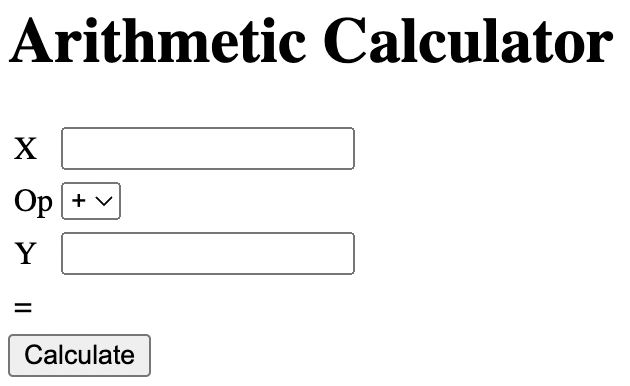

# Package `examples`

The `examples` package holds several examples that demonstrate how the `Connector` can be used to create microservices.

## Hello

The `hello.example` microservice demonstrates some of the key capabilities of the framework using various endpoints.

`/echo` echos the incoming HTTP request in text format. This is a useful tool for looking at the HTTP control headers `Microbus-` added by the framework.

http://localhost:8080/hello.example/echo produces:

```http
GET /echo HTTP/1.1
Host: hello.example
User-Agent: Mozilla/5.0
Accept-Encoding: gzip, deflate, br
Accept-Language: en-US,en;q=0.9
Connection: keep-alive
Microbus-Call-Depth: 1
Microbus-From-Host: http.ingress.sys
Microbus-From-Id: tg190vjj3j
Microbus-Msg-Id: UQnfaJf4
Microbus-Time-Budget: 19749
Sec-Ch-Ua: "Chromium";v="104", " Not A;Brand";v="99"
Sec-Ch-Ua-Mobile: ?0
Sec-Ch-Ua-Platform: "macOS"
Sec-Fetch-Dest: document
Sec-Fetch-Mode: navigate
Sec-Fetch-Site: none
Sec-Fetch-User: ?1
Upgrade-Insecure-Requests: 1
```

The `/ping` endpoint broadcasts a ping to discover the identity of all microservices running on the cluster.

The `/hello` endpoint renders a simple greeting. It demonstrates the use of configs as well as taking in arguments from the URL. The single endpoint `/hello` takes in a query argument `name` and prints the greeting specified in the `Greeting` config, repeated as many times as indicate by the `Repeat` config. The values of these configs are set in `examples/main/env.yaml`.

http://localhost:8080/hello.example/hello?name=Bella prints:

```
Ciao, Bella!
Ciao, Bella!
Ciao, Bella!
```

The `/calculator` endpoint renders a rudimentary UI of a calculator. Behind the scenes, this endpoint calls the `calculator.example/arithmetic` endpoint to perform the calculation itself, demonstrating service-to-service calls. The `calculator.example` microservice is discussed next.



## Calculator

The `calculator.example` microservice implement two endpoints, `/arithmetic` and `/square` in order to demonstrate parsing of query arguments and error handling.

The `/arithmetic` endpoint takes query arguments `x` and `y` of type integer, and one of four operators in the `op` argument: `+`, `-`, `/` and `*`. The response is a JSON structure.

http://localhost:8080/calculator.example/arithmetic?x=5&op=*&y=-8 produces:

```
{"x":5,"op":"*","y":-8,"result":-40}
```

The `/square` endpoint takes a single integer `x` and prints its square.

http://localhost:8080/calculator.example/square?x=55 produces:

```
{"x":55,"op":"*","y":55,"result":3025}
```

If the arguments cannot be parsed, an error is returned.

http://localhost:8080/calculator.example/square?x=not-valid results in:

```
strconv.ParseInt: parsing "not-valid": invalid syntax

calculator.(*Service).Square
	/src/github.com/microbus-io/fabric/examples/calculator/service.go:84
connector.(*Connector).onRequest
	/src/github.com/microbus-io/fabric/connector/subscribe.go:258
	https://calculator.example:443/square
connector.(*Connector).onRequest
	/src/github.com/microbus-io/fabric/connector/subscribe.go:259
connector.(*Connector).makeHTTPRequest
	/src/github.com/microbus-io/fabric/connector/publish.go:232
	http.ingress.sys -> calculator.example
connector.(*Connector).Request
	/src/github.com/microbus-io/fabric/connector/publish.go:44
httpingress.(*Service).ServeHTTP
	/src/github.com/microbus-io/fabric/services/httpingress/service.go:125
```

## Messaging

This mic

The `/home` endpoint of the `messaging.example` microservice demonstrates the two messaging patterns: load-balanced request/response (unicast), and pub/sub (multicast).

The output of http://localhost:8080/messaging.example/home looks like this:

```
Processed by: t76uebedrq

Request/response (unicast):
> DefaultQueue t76uebedrq

Pub/sub (multicast):
> NoQueue p6ftpg98cc
> NoQueue 9t64gvbdk1
> NoQueue t76uebedrq

Direct addressing (unicast):
> NoQueue t76uebedrq

Refresh the page to try again
```

The first paragraph indicates the current instance ID of the microservice that is processing the `/home` request. Because there are 3 instances added to the app that are load-balanced, this ID changes.

```go
func main() {
	app := application.New(
		httpingress.NewService(),
		hello.NewService(),
		messaging.NewService(),
		messaging.NewService(),
		messaging.NewService(),
		calculator.NewService(),
	)
	app.Run()
}
```

The second paragraph is showing the result of making a unicast request to the `/default-queue` endpoint. Only one of the 3 instances responds. A random instance is chosen by NATS, effectively load-balancing between the instances.

The third paragraph is showing the result of making a multicast request to the `/no-queue` endpoint. All 3 of the instances respond. The order of arrival of the responses is random.

The fourth paragraph is showing the result of making a direct addressing request. Even though the `/no-queue` endpoint is a pub/sub endpoint, only the one specific instance responds.

Refresh the page to see the IDs change:

* The processor ID may change
* The responder to the unicast request may change
* The order of the responses to the multicast may change
