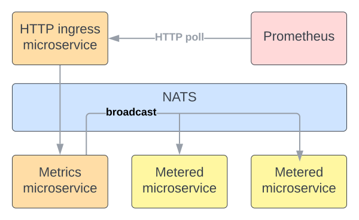

# Package `services/metrics`

The `Microbus` framework relies on `Prometheus` for the collection of metrics. `Prometheus` pulls metrics from the metrics system microservice, which in turn pulls and aggregates metrics from all microservices it can reach on the NATS bus.



The endpoint to obtain metrics from the metrics microservice is `https://localhost:8080/metrics.sys/collect`. An optional argument `service` can be used to obtain the metrics of an individual service. The `secretkey` argument is mandatory except in local development and testing. It must match the value set for the `SecretKey` configuration property or else the request will be refused.

Metrics can also be obtained from a microservice directly at `https://localhost:8080/hello.example:888/metrics`.

## Standard Metrics

By default, all microservices produce a standard set of metrics:

* The microservice's uptime
* Histogram of the execution time of callbacks such as `OnStartup`, `OnShutdown`, tickers, etc.
* Histogram of the processing time of incoming requests
* Histogram of the size of the response to incoming requests
* Count of the result of outgoing requests
* Histogram of time to receive an acknowledgement from a downstream microservice
* Count of log messages recorded
* Count of distributed cache hits and misses
* Total weight of the distributed cache

## Application Metrics

In addition, application developers are able to define and collect arbitrary metrics that are pertinent to their specific application, using the `DefineMetric`, `ObserveMetric` and `IncrementMetric` methods of the `Connector`. [Code generation](../tech/codegen.md) can be used to assist in the definition of metrics.

```yaml
# Metrics
#
# signature - Func(measure Type, label Type, label Type)
#	 RequestDurationSeconds(dur time.Duration, method string, success bool)
#	 MemoryUsageBytes(b int64)
#	 DistanceMiles(miles float64, countryCode int)
#	 RequestsCount(count int, domain string) - unit-less accumulating count
#	 CPUSecondsTotal(dur time.Duration) - accumulating count with unit
#	 See https://prometheus.io/docs/practices/naming/ for naming best practices
# description - Documentation
# kind - The kind of the metric, "histogram", "gauge" or "counter" (default)
# buckets - Bucket boundaries for histograms [x,y,z,...]
# alias - The name of the metric in Prometheus (defaults to package+function in snake_case)
metrics:
  - signature: Likes(num int, postId string)
    description: Likes counts the number of likes for a given post.
    kind: counter
    alias: myapp_message_post_number_of_likes
```

With regard to alias names, see [naming best practices](https://prometheus.io/docs/practices/naming/) for best practices.

The [collector types](https://prometheus.io/docs/concepts/metric_types/) supported are:

* Counter
* Histogram
* Guage

## Code Examples

`IncrementLikes` would be created by the code generator based on the `service.yaml` example above.

```go
func (svc *Intermediate) IncrementLikes(num int, postId string) error {
	...
}

func (svc *Intermediate) MyFunc() error {
	// ...

	// A like has been registered and we want this reflected in Prometheus.
	err := svc.IncrementLikes(1, postId)
	if err != nil {
		return errors.Trace(err)
	}
	return nil
}
```
