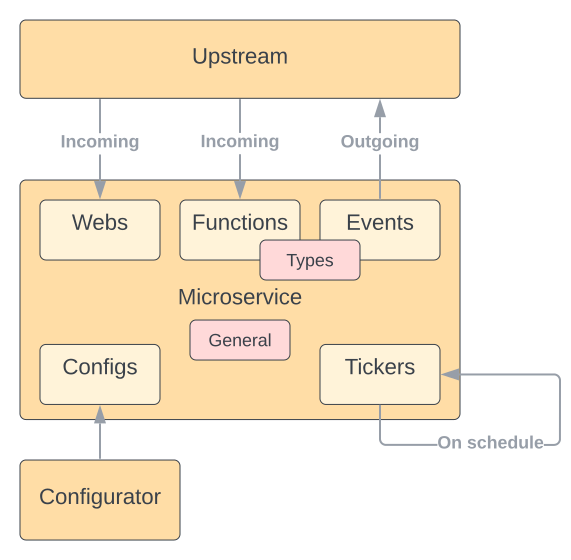

# Code Generation

Automatic code generation is `Microbus`'s most powerful tool. It facilitates rapid development (RAD) of microservices and significantly increases developer productivity. Although it's possible to create a microservice by working directly with the `Connector`, the abstraction added by the code generator makes things simpler by taking care of much of the repetitive boilerplate code.

Code generation in `Microbus` is additive and idempotent. When new functionality is added,
code changes are generated incrementally without impacting the existing code.

## Bootstrapping

Code generation starts by introducing the `//go:generate` directive into any source file in the directory of the microservice. The recommendation is to add it to a `doc.go` file:

```go
//go:generate go run github.com/microbus-io/fabric/codegen

package myservice
```

The next step is to create a `service.yaml` file which will be used to specify the functionality of the microservice. If the directory contains only a `doc.go` or an empty `service.yaml`, running `go generate` inside the directory will automatically populate `service.yaml`.

## Service.yaml

In `service.yaml`, developers are able to define the various pieces of the microservice in a declarative fashion. Code generation picks up these definitions to generate boilerplate code, leaving it up to the developer to implement the business logic. As noted earlier, declarations can be added over time and applied incrementally.

`service.yaml` include several sections: general, configs, functions, events, types, webs and tickers. Combined, these define the characteristics of the microservice.



### General

The `general` section of `service.yaml` defines the `host` name of the microservice and its human-friendly `description`. The host name is required. It will be how the microservice is addressed by other microservices. A hierarchical naming scheme for host names such as `myservice.mydomain.myproduct` can help avoid conflicts.

```yaml
# General
#
# host - The host name of the microservice
# description - A human-friendly description of the microservice
# integrationTests - Whether or not to generate integration tests (defaults to true)
general:
  host: email.communication.xyz
  description: The email service delivers emails to recipients.
```

### Configs

The `configs` section is used to define the [configuration](./configuration.md) properties of the microservices. Config properties get their values in runtime from the [configurator](../structure/services-configurator.md) system microservice. 

```yaml
# Config properties
#
# signature - Func() (val Type)
# description - Documentation
# default - A default value (defaults to empty)
# validation - A validation pattern
#   str ^[a-zA-Z0-9]+$
#   bool
#   int [0,60]
#   float [0.0,1.0)
#   dur (0s,24h]
#   set Red|Green|Blue
#   url
#   email
#   json
# callback - "true" to handle the change event (defaults to "false")
# secret - "true" to indicate a secret (defaults to "false")
configs:
  - signature:
    description:
    default:
    validation:
    callback:
    secret:
```

The `signature` is required. It defines the name and type of the property. The name must start with an uppercase letter. Types are limited to `string`, `bool`, `int`, `float` or `Duration`.

`validation` is enforced before accepting a new value for the config property. A validation comprises of a type and an optional regexp (for strings) or range (for numeric types).

If `callback` is set to `true`, a callback function will be generated and called when the value changes in runtime.

```go
// OnChangedFoo is triggered when the value of the Foo config property changes.
func (svc *Service) OnChangedFoo(ctx context.Context) (err error) {
    return
}
```

### Functions

`functions` define a web endpoint that is made to appear like a function (RPC). Input arguments are pulled from either the JSON body of the request or from the query arguments. Output arguments are written as JSON to the body of the response.

```yaml
# Functions
#
# signature - Func(name Type, name Type) (name Type, name Type, httpStatusCode int)
# description - Documentation
# path - The subscription path
#   (empty) - The function name in kebab-case
#   /path - Default port :443
#   /directory/ - All paths under the directory
#   :443/path
#   :443/... - Ellipsis denotes the function name in kebab-case
#   :443 - Root path
#   https://example.com:443/path
# queue - The subscription queue
#   default - Load balanced (default)
#   none - Pervasive
functions:
  - signature:
    description:
    path:
    queue:
```

The `signature` defines the function name (which must start with an uppercase letter) and the input and output arguments. The special output argument `httpStatusCode` can be used to set the HTTP status code of the response.

The code generated functional request handler will look similar to the following. `Microbus` is taking care of marhsaling and unmarshaling behind the scenes.

```go
/*
FuncHandler is an example of a functional handler.
*/
func (svc *Service) FuncHandler(ctx context.Context, id string) (ok bool, httpStatusCode int, err error) {
    return
}
```

Along with the host name of the service, the `path` defines the URL to this endpoint. It defaults to the function name in `kebab-case`.

`queue` defines whether a request is routed to one of the replicas of the microservice (load-balanced) or to all (pervasive).

### Event Sources

`events` are very similar to functions except they are outgoing rather than incoming function calls. An event is fired without knowing in advance who is (or will be) subscribed to handle it. [Events](../tech/events.md) are useful to push notifications of events that occur in the microservice that may interest upstream microservices. For example, `OnUserDeleted(id string)` could be an event fired by a user management microservice.

```yaml
# Event sources
#
# signature - OnFunc(name Type, name Type) (name Type, name Type, httpStatusCode int)
# description - Documentation
# path - The subscription path
#   (empty) - The function name in kebab-case
#   /path - Default port :417
#   /directory/ - All paths under the directory
#   :417/path
#   :417/... - Ellipsis denotes the function name in kebab-case
#   :417 - Root path
#   https://example.com:417/path
events:
  - signature:
    description:
    path:
```

The `signature` defines the event name (which must start with the word `On` followed by an uppercase letter) and the input and output arguments. In `Microbus`, events are bi-directional and event sinks may return values back to the event source. The special output argument `httpStatusCode` can be used to set the HTTP status code of the response.

### Event Sinks

`sinks` are the flip side of event sources. A sink subscribes to receive notification of events that are generated by other services.

```yaml
# Event sinks
#
# signature - OnFunc(name Type, name Type) (name Type, name Type, httpStatusCode int)
# description - Documentation
# event - The name of the event at the source (defaults to the function name)
# source - The package path of the microservice that is the source of the event
# forHost - For an event source with an overridden host name
# queue - The subscription queue
#   default - Load balanced (default)
#   none - Pervasive
sinks:
  - signature:
    description:
    event:
    source: package/path/of/another/microservice
```

The `signature` of an event sink must match that of the event source. The one exception to this rule is the option to use an alternative name for the handler function while providing the original event name in the `event` field. This allows an event sink to resolve conflicts if different event sources use the same name for their events. That becomes necessary because handler function names must be unique in the scope of the sink microservice.

```yaml
sinks:
  - signature: OnDeleteUser(userID string)
    event: OnDelete
    source: package/path/to/user/store
  - signature: OnDeleteGroup(groupID string)
    event: OnDelete
    source: package/path/to/group/store
```

The `source` must point to the microservice that is the source of the event. This is the fully-qualified package path.

The optional field `forHost` adjusts the subscription to listen to microservices whose host name was overridden with `SetHostName`.

### Web Handlers

The `webs` sections defines low-level web handlers which allow the microservice to handle incoming web requests as it sees fit.

```yaml
# Web handlers
#
# signature - Func()
# description - Documentation
# path - The subscription path
#   (empty) - The function name in kebab-case
#   /path - Default port :443
#   /directory/ - All paths under the directory
#   :443/path
#   :443/... - Ellipsis denotes the function name in kebab-case
#   :443 - Root path
#   https://example.com:443/path
# queue - The subscription queue
#   default - Load balanced (default)
#   none - Pervasive
webs:
  - signature:
    description:
    path:
    queue:
```

The `signature` may not include any arguments. The handler receives the typical `http.ResponseWriter`, and `*http.Request` and is expected to extract input from there directly.

The code generated web handler will look similar to this:

```go
/*
WebHandler is an example of a web handler.
*/
func (svc *Service) WebHandler(w http.ResponseWriter, r *http.Request) (err error) {
    return nil
}
```

### Tickers

Tickers are means to invoke a function on a periodic basis. The `signature` and `interval` fields are required.

```yaml
# Tickers
#
# signature - Func()
# description - Documentation
# interval - Duration between iterations (e.g. 15m)
# timeBudget - Duration to complete an iteration
tickers:
  - signature:
    description:
    interval:
    timeBudget:
```

The code generated ticker handler will look similar to this:

```go
/*
TickerHandler is an example of a ticker handler.
*/
func (svc *Service) TickerHandler(ctx context.Context) (err error) {
    return nil
}
```

### Types

All complex (struct) non-primitive types used in `functions` and `events` must be declared in the `types` section. Primitive types are `int`, `float`, `byte`, `bool`, `string`, `Time` and `Duration`. Maps (dictionaries) and arrays are also allowed. Types that are _owned_ by this microservice are defined locally to this microservice. Types that are owned by other microservices but are _used_ by this microservices must be imported by pointing to the fully-qualified path of their package.

Complex types may contain other complex types in which case those nested types also must be declared.

```yaml
# Types
#
# name - All non-primitive types used in functions must be accounted for
# description - Documentation
# define - Define a new type with the specified fields (name: type)
# import - The name of the imported type (defaults to the function name)
# source - The package path of the microservice that defines the type
types:
  - name:
    description:
    define:
      fieldName: Type
  - name:
    description:
    import:
    source:
```

## Clients

In addition to the server side of things, the code generator also creates clients to facilitate calling the microservice. A unicast `Client` and a multicast `MulticastClient` are placed in a separate API package to reduce the chance of cyclical dependencies between upstream and downstream microservices.

With clients, an upstream microservice remotely calling a downstream microservice looks very much like a standard local function call.

```go
result, err := downstreamapi.NewClient(upstreamSvc).Add(ctx, x, y)
```

For microservices that fire events (i.e. event sources), the API package implements a `MulticastTrigger` and a `Hook`. `MulticastTrigger` is used to facilitate the triggering of events and should generally be used only by the microservice itself. `Hook` is used to facilitate other microservices in subscribing to the events of this microservice.

## Integration Testing

Placeholder [integration tests](./integrationtesting.md) are generated for each of the microservice's handlers to encourage developers to test each of them and achieve high code coverage.

## Embedded Resources

A `resources` directory is automatically created with a `//go:embed` directive to allow microservices to bundle resource files along with the executable. The `embed.FS` is made available via `svc.Resources()`.

## Versioning

The code generator tool calculates a hash of the source code of the microservice. Upon detecting a change in the code, the tool increments the version number of the microservice, storing it in `version-gen.go`. The version number is used to differentiate among different builds of the microservice.

## Generated Code Structure

The code generator creates quite a few files and sub-directories in the directory of the microservice.

```
{service}
  app
    {service}
      main-gen.go
  {service}api
    clients-gen.go
    types-gen.go
  intermediate
    intermediate-gen.go
    mock-gen.go
  resources
    embed-gen.go
  integration_test.go
  integration-gen_test.go
  service-gen.go
  service.go
  version-gen_test.go
  version-gen.go
```

Files that include `-gen` in their name are fully code generated and should not be edited.

The `app` directory hosts `package main` of an `Application` that runs the microservice. This is what eventually gets built and deployed. The executable will be named like the package name of the microservice.

The `{service}api` directory (and package) defines the `Client` and `MulticastClient` of the microservice and the complex types (structs) that they use. `MulticastTrigger` and `Hook` are defined if the microservice is a source of events. Together these represent the public-facing API of the microservice to upstream microservices. The name of the directory is derived from that of the microservice in order to make it easily distinguishable in code completion tools.

The `intermediate` directory (and package) defines the `Intermediate` and the `Mock`. The `Intermediate` serves as the base of the microservice via anonymous inclusion and in turn extends the [`Connector`](../structure/connector.md). The `Mock` is a mockable stub of the microservices for that can be used in [integration testing](./integrationtesting.md) when a live version of the microservice cannot.

`integration-gen_test.go` is a testing harness that that facilitates the implementation of integration tests. Those are expected to be implemented in `integration_test.go`

The `resources` directory is a place to put static files to be embedded (linked) into the executable of the microservice. Templates, images, scripts, etc. are some examples of what can potentially be embedded.

`service-gen.go` primarily includes the function to create a `NewService`. It may also alias the config initializers of the `Intermediate` and its `With` function, if appropriate.

`service.go` is where application developers are expected to introduce the business logic of the microservice. `service.go` implements `Service`, which extends `Intermediate` as mentioned earlier. Most of the tools that a microservice needs are available through the receiver `(svc *Service)` which points to the `Intermediate` and by extension the `Connector`. It include the methods of the `Connector` as well as type-specific methods defined in the `Intermediate`.

```go
type Intermediate struct {
    *connector.Connector
}

type Service struct {
    *intermediate.Intermediate
}

func (svc *Service) DoSomething(ctx context.Context) (err error) {
    // svc points to the Intermediate and by extension the Connector
}
```

In addition to the standard `OnStartup` and `OnShutdown` callbacks, the code generator creates an empty function in `service.go` for each and every web handler, functional handler, event sink, ticker or config change callback defined in `service.yaml` as described earlier.

```go
// OnStartup is called when the microservice is started up.
func (svc *Service) OnStartup(ctx context.Context) (err error) {
    return
}

// OnShutdown is called when the microservice is shut down.
func (svc *Service) OnShutdown(ctx context.Context) (err error) {
    return
}
```

`version-gen.go` holds the SHA256 of the source code and the auto-incremented version number. `version-gen_test.go` makes sure it is up to date. If the test fails, running `go generate` brings the version up to date.
