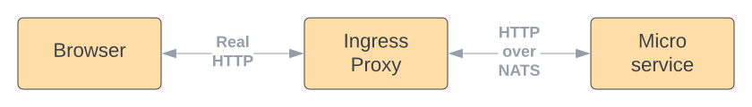
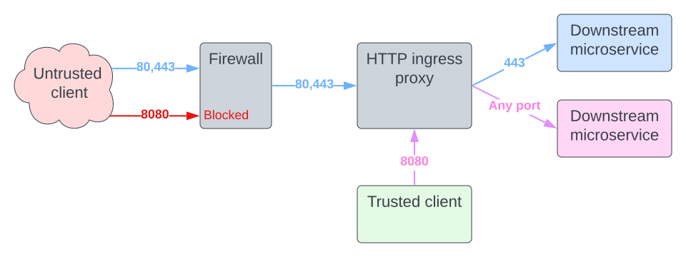

# HTTP Ingress Proxy

## Purpose

Think of NATS as a closed garden that requires a special key to access. In order to send and receive messages over NATS, it's necessary to use the NATS libraries to connect to NATS. This is basically what the `Connector` is facilitating for service-to-service calls.

Practically all applications require interaction from a source that is outside the NATS bus. The most common scenario is perhaps a request generated from a web browser to a public API endpoint. In this case, something needs to bridge the gap between the incoming real HTTP request and the HTTP messages that travel over the bus. This is exactly the role of the HTTP ingress proxy.



On one end, the HTTP ingress proxy listens on port `:8080` for real HTTP requests; on the other end it is connected to NATS. The ingress proxy converts real requests into requests on the bus; and on the flip side, converts responses from the bus to real responses. Because the bus messages in `Microbus` are formatted themselves as HTTP messages, this conversion is trivial, with minor adjustments:

* The proxy filters out `Microbus-` control headers from coming in or leaking out
* The first segment of the path of the real HTTP request is treated as the host name of the microservice on the bus. So for example, `http://localhost:8080/echo.example/echo` is translated to the bus address `https://echo.example/echo` which is then mapped to the NATS subject `microbus.443.example.echo.|.echo`.
* Port `:443` is assumed by default when a port is not explicitly specified. Internal ports can be designated in the first segment of the path. For example, `http://localhost:8080/echo.example:1234/echo` is mapped to the bus address `https://echo.example:1234/echo`.
* The root path is transformed to `/root`, therefore `http://localhost:8080/` is mapped to `https://root`.

## Configuration

The HTTP ingress proxy supports several configuration properties that can be set in in `config.yaml`:

```yaml
http.ingress.sys:
  Ports: 9090
```

`Ports` is a comma-separated list of HTTP ports on which to listen for requests. The default is to listen on port `:8080`.

`PortMappings` is a comma-separated list of mappings in the form `x:y->z` where `x` is the inbound
HTTP port, `y` is the requested internal port, and `z` is the internal port to serve.
Put differently, an HTTP request `https://ingresshost:x/servicehost:y/path` is mapped to internal NATS
request `https://servicehost:z/path`.
Both `x` and `y` can be `*` to indicate all ports. Setting `z` to `*` indicates to serve the requested
port `y` without change. More specific rules take precedence over `*` rules.

Ports can be used to differentiate between traffic that is coming from trusted and untrusted sources. For example, the default setting `8080:*->*, 443:*->443, 80:*->443` grants port `:8080` access to all internal ports, while ports `:443` and `:80` are restricted to internal port `:443`. The idea is to expose ports `:443` and `:80` to the internet and restrict `:8080` to trusted clients only.



Four config properties are used to safeguard against long requests:

* `ReadHeaderTimeout` is the timeout to read the request's header
* `ReadTimeout` is the timeout to read the full request, including the header
* `TimeBudget` is the time budget allocated to the downstream microservice to process the request
* `WriteTimeout` is the timeout to write the response back to the client


`RequestMemoryLimit` is the memory capacity used to hold pending requests, in megabytes.

`AllowedOrigins` is a comma-separated list of CORS origins to allow requests from. The `*` origin can be used to allow CORS request from all origins.

`Middleware` defines a microservice to delegate all requests to.
The URL of the middleware must be fully qualified, for example,
`https://middle.ware/serve` or `https://middle.ware:123`.

## Respected Headers

The HTTP ingress proxy respects the following incoming headers:

* `Request-Timeout` can be used to override the default time-budget of the request
* `Accept-Encoding` with `br`, `deflate` or `gzip` can be used to compress the response
* `X-Forwarded-Host`, `X-Forwarded-Port`, `X-Forwarded-Proto` and `X-Forwarded-Prefix` are augmented with the ingress proxy's information 
* `Origin` may cause a request to be blocked
