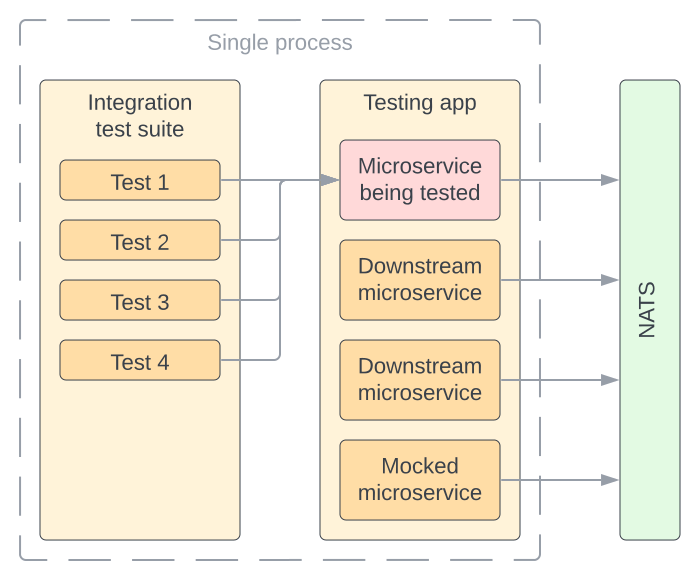

# Integration Testing

## Testing App

Thorough testing is an important cornerstone of good software. Testing a microservice is generally difficult because it almost always depends on downstream microservices which are not easy to spin up during testing. Common workarounds include mocking the downstream microservices or testing against a live test deployment environment but each of these comes with its own drawbacks. A mock doesn't test the actual internal business logic of the microservice, obscuring changes made to it over time. A live test environment doesn't suffer from the drawbacks of a mock but it is a single point of failure that can block an entire development team when it's down. It also tends to become inconsistent over time and is expensive to run 24/7.

`Microbus` takes a different approach and spins up the actual downstream microservices along with the microservice being tested into a single process. The microservices are collected into an isolated [`Application`](../structure/application.md) that is started up for the duration of running the test suite and shutdown immediately thereafter. The microservices communicate via NATS on a random [plane of communications](./unicast.md), which keeps them isolated from other test suites that may run in parallel.

Mocks can be added to the application when it's impractical to run the actual downstream microservice, for example if that microservice is calling a third-party web service such as a payment processor. The preference however should be to include the actual microservice whenever possible and not rely on mocks. Note that in `Microbus` microservices are mocked rather than clients. The upstream microservice still sends messages over NATS which are responded to by the mock.



## Code Generated Test Harness

This is all rather complicated to set up which is where the [code generator](./codegen.md) comes into the picture and automatically creates a test harness (`integration-gen_test.go`) and placeholder tests (`integration_test.go`) for each of the microservice's endpoints out of the specification of the microservice (`service.yaml`). It is then left for the developer to initialize the testing app and implement the tests.

### Initializing the Testing App

The code generator prepares the testing app `App` and includes in it the microservice being tested `Svc`. All dependencies on downstream microservices must be added to the app manually, using the `NewService` constructor of that service. During testing, the [configurator](../structure/coreservices-configurator.md) core microservice is disabled and microservices must be configured using the `With` method instead. If the microservice under test defines any configuration properties, they are pre-listed for convenience commented-out inside a call to `With`.

```go
// Initialize starts up the testing app.
func Initialize() error {
	// Include all downstream microservices in the testing app
	// Use .With(options) to initialize with appropriate config values
	App.Include(
		Svc.With(
			NumLines(10),
		),
		downstream.NewService().With(
			downstream.Timeout(2*time.Minute),
		),
	)

	err := App.Startup()
	if err != nil {
		return err
	}
// All microservices are now running

	return nil
}
```

### Testing Functions and Event Sinks

For each endpoint, the testing harness `integration-gen_test.go` defines a corresponding test case which invokes the underlying endpoint and provides asserters on the result. In the following example, `Arithmetic` calls `Svc.Arithmetic` behind the scenes and returns an `ArithmeticTestCase` with asserters that are customized for its return values. It only takes the developer but a few lines of code to run various test cases against the endpoint.

```go
func TestCalculator_Arithmetic(t *testing.T) {
	t.Parallel()
	/*
		Arithmetic(t, ctx, x, op, y).
			Expect(xEcho, opEcho, yEcho, result).
			NoError().
			Error(errContains).
			ErrorCode(http.StatusOK).
			Assert(func(t, xEcho, opEcho, yEcho, result, err))
	*/
	ctx := Context(t)
	Arithmetic(t, ctx, 3, "-", 8).Expect(3, "-", 8, -5)
	Arithmetic(t, ctx, -9, "+", 9).Expect(-9, "+", 9, 0)
	Arithmetic(t, ctx, -9, " ", 9).Expect(-9, "+", 9, 0)
	Arithmetic(t, ctx, 5, "*", 5).Expect(5, "*", 5, 25)
	Arithmetic(t, ctx, 5, "*", -6).Expect(5, "*", -6, -30)
	Arithmetic(t, ctx, 15, "/", 5).Expect(15, "/", 5, 3)
	Arithmetic(t, ctx, 15, "/", 0).Error("zero")
	Arithmetic(t, ctx, 15, "z", 0).Error("operator")
}
```

### Testing Webs

Raw web endpoints are tested in a similar fashion, except that their asserters are customized for a web request. In the following example, `Hello` takes in options to customize the web request (method, body, query arguments or headers) and the resulting `HelloTestCase` includes asserters that are tailored to an `http.Response` return value. Note how asserters can be chained.

```go
func TestHello_Hello(t *testing.T) {
	t.Parallel()
	/*
		Hello(t, ctx, httpRequest).
			StatusOK().
			StatusCode(statusCode).
			BodyContains(bodyContains).
			BodyNotContains(bodyNotContains).
			HeaderContains(headerName, valueContains).
			NoError().
			Error(errContains).
			ErrorCode(http.StatusOK).
			Assert(t, func(t, httpResponse, err))
	*/
	ctx := Context(t)
	Hello(t, ctx, GET()).
		BodyContains(Svc.Greeting()).
		BodyNotContains("Maria")
	Hello(t, ctx, GET(), QueryArg("name", "Maria")).
		BodyContains(Svc.Greeting()).
		BodyContains("Maria")
}
```

### Testing Tickers

Tickers don't run during testing in order to avoid the unpredictability of their running schedule. Instead, tickers are tested manually like other endpoints. Tickers don't take arguments nor return values so the only testing possible is error validation.

```go
func TestHello_TickTock(t *testing.T) {
	t.Parallel()
	/*
		TickTock(t, ctx).
			NoError().
			Error(errContains).
			ErrorCode(http.StatusOK).
			Assert(func(t, err))
	*/
	ctx := Context(t)
	TickTock(t, ctx).NoError()
}
```

### Testing Config Callbacks

Callbacks that handle changes to config property values are similarly tested.

```go
func TestExample_OnChangedConnectionString(t *testing.T) {
	t.Parallel()
	/*
		OnChangedConnectionString(t, ctx).
			NoError().
			Error(errContains).
			ErrorCode(http.StatusOK).
			Assert(err)
	*/
	ctx := Context(t)
	OnChangedConnectionString(t, ctx).NoError()
}
```

### Testing Event Sources

Events are tested through a corresponding event sink. The event test case must be defined prior to the firing of the event. In the following example, `OnAllowRegister` defines the event test case and `Register` fires the event.

Note how assertion is reversed: input arguments of the event sink are asserted while its output is explicitly specified.

```go
func TestExample_OnAllowRegister(t *testing.T) {
	// No parallel
	/*
		OnAllowRegister(t, allow, err).
			Expect(email).
			Assert(func(t, ctx, email))
	*/
	ctx := Context(t)
	OnAllowRegister(t, true, nil).
		Name("Allowed").
		Expect("barb@example.com")
	Register(t, ctx, "barb@example.com").Expect(true)
	OnAllowRegister(t, false, nil).
		Name("Disallowed").
		Expect("josh@example.com")
	Register(t, ctx, "josh@example.com").Expect(false)
}
```

### Skipping Tests

A removed test will be regenerated on the next run of the code generator, so disabling a test is best achieved by placing a call to `t.Skip()` along with an explanation of why the test was skipped.

```go
func TestEventsink_OnRegistered(t *testing.T) {
	t.Skip() // Tested elsewhere
}
```

### Parallelism

The code generator specifies to run all tests in parallel by default. The assumption is that tests written in a single test suite are implemented as to not interfere with one another. Commenting out `t.Parallel()` runs that test separately from other tests, however the order of execution of tests is not guaranteed and care must be taken to reset the state at the end of a test that may interfere with another.

## Mocking

Sometimes, using the actual microservice is not possible because it depends on a resource that is not available in the testing environment. For example, a microservice that makes requests to a third-party web service should be mocked in order to avoid depending on that service for development.

In order to more easily mock microservices, the code generator creates a `Mock` for every microservice. This mock includes type-safe methods for mocking all the endpoints of the microservice. If mocking is going to be the same for all tests, the mock can be permanently included in the application in the initialization phase.

```go
// Initialize starts up the testing app.
func Initialize() error {
	mockWebPaySvc := webpay.NewMock()
	mockWebPaySvc.MockCharge = func(ctx context.Context, userID string, amount int) (success bool, balance int, err error) {
		return true, 100, nil
	}

	// Include all downstream microservices in the testing app
	// Use .With(options) to initialize with appropriate config values
	App.Include(
		Svc.With(
			NumLines(10),
		),
		mockWebPaySvc,
	)

	err := App.Startup()
	if err != nil {
		return err
	}
// All microservices are now running

	return nil
}
```

If mocking is going to be different for individual tests, a mock should be temporarily joined to the app in each relevant test instead. More likely than not, these tests should not run in parallel. In the following fictitious example, the `ChargeUser` endpoint of the `payment` microservice is calling a downstream microservice `webpay` that wraps the functionality of a third-party payment processor cloud service. `webpay` is mocked to fail payments over $200 and emulate an error if the amount is $503.

```go
func TestPayment_ChargeUser(t *testing.T) {
	// No parallel due to side effect of mocking

	/*
		ChargeUser(ctx, userID, amount).
			Expect(t, success).
			NoError(t).
			Error(t, errContains).
			Assert(t, func(t, success, err))
	*/

	mockWebPaySvc := webpay.NewMock()
	mockWebPaySvc.MockCharge = func(ctx context.Context, userID string, amount int) (success bool, balance int, err error) {
		if amount >= 200 {
			return false, 100, nil
		}
		if amount == 503 {
			return false, 0, errors.New("service unavailable")
		}
		return true, 100, nil
	}

	// Temporarily join the mock to the app
	App.Join(mockWebPaySvc)
	mockWebPaySvc.Startup()
	defer mockWebPaySvc.Shutdown()

	ctx := Context(t)
	ChargeUser(ctx, "123", 500).Expect(t, false)
	ChargeUser(ctx, "123", 100).Expect(t, true)
	ChargeUser(ctx, "123", 503).Error(t, "service unavailable")
}
```
