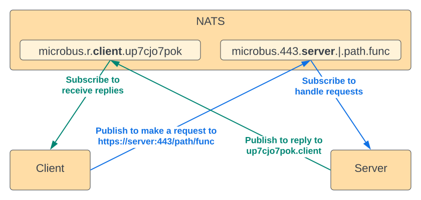

# Messaging

## Overview

One of the challenges with messaging buses is that they have an unfamiliar pattern that doesn't map well to modern web standards. When it comes to microservices, most developers are accustomed to thinking in terms of synchronous HTTP, not asynchronous messaging over a bus.
`Microbus` overcomes this gap by emulating the familiar synchronous request/response pattern of HTTP over the asynchronous messaging pattern of NATS.

For starters, while NATS supports a purely arbitrary binary message format, `Microbus`'s messages adhere to the HTTP/1.1 request and response message formats. This is done for several reasons:
* The HTTP format includes a meta-data section in the form of headers in addition to an unrestricted binary body. The headers are ideal for sending the control information necessary to make the `Microbus` magic happen
* The HTTP format is familiar to developers
* There are plenty of tools and libraries to work with the HTTP format
* Conversion to and from "real" HTTP is trivial. The section about the ingress proxy will touch on that

## Emulating Request/Response



Request/response is achieved by utilizing carefully crafted subjects (topics) as means of delivering messages to their destination. Each endpoint of a microservice is assigned a dedicated subject based on the path it wants to handle. For example, the URL `https://www.example.com:443/path/func` is mapped to the NATS subject `microbus.443.com.example.www.|.path.func`. With that, when a microservice wants to handle calls to any given endpoint (identified by a URL path) it will subscribe to the appropriate NATS subject and when a microservice wants to make a call to another microservice's endpoint (path), all it has to do is publish a message to the same subject.

In addition to any subscriptions that a microservice makes to handle incoming calls, it also creates a subscription at which it expects to receive replies. The format of this subject is `microbus.r.com.example.zzz.up7cjo7pok`. The `r` prefix can be thought of as designating the reply port. The `up7cjo7pok` is the unique instance ID of the microservice. So now, when a serving microservice wants to respond to a call from a client microservice, all it has to do is publish the response to the reply subject of the client.

It is necessary for the client to provide a return address in order for the server to know where to respond to. To facilitate that, each request made over the bus must include two special HTTP headers, `Microbus-From-Host` and `Microbus-From-Id`, that enable the server to construct the reply subject.

Another important header included by the client in each request is `Microbus-Msg-Id` which the server is required to echo back in the response. The client can be making thousands of requests in parallel whose responses can return in no particular order and the message ID in needed to map each response to the corresponding request. In the code, a `chan *http.Response` is created for each outgoing request and indexed by the message ID in a `map[string]chan *http.Response`. Requests awaits on the channel until a response comes back or a timeout occurs.

## Example Walk-Through

To look at an example that puts this all together, start NATS in debug mode in another window using `./nats-server -D -V` and then run the `TestEcho` unit test located in `connector/messaging.go`. Redacted for brevity, the output looks like this:

NATS server starting

```
[INF] Starting nats-server version 1.4.1
[DBG] Go build version go1.17.3
[INF] Git commit [not set]
[INF] Listening for client connections on 0.0.0.0:4222
[DBG] Server id is 5eBkFRs9kHYJlrAib3Nrlp
[INF] Server is ready
```

The microservices `alpha.echo.connector` starts up and subscribes to the reply subject `microbus.r.connector.echo.alpha.s6gerdf3o5`.

```
[DBG] cid:1 - Client connection created
[TRC] cid:1 - ->> [CONNECT {"verbose":false,"pedantic":false,"tls_required":false,"name":"","lang":"go","version":"1.16.0","protocol":1,"echo":true,"headers":false,"no_responders":false}]
[TRC] cid:1 - ->> [PING]
[TRC] cid:1 - <<- [PONG]
[TRC] cid:1 - ->> [SUB microbus.r.connector.echo.alpha.s6gerdf3o5 s6gerdf3o5 1]
```

The microservices `beta.echo.connector` starts up and subscribes to the reply subject `microbus.r.connector.echo.beta.o6cfdjocuq` and to the endpoint subject `microbus.443.connector.echo.beta.|.echo`. If you look closely at `[SUB microbus.443.connector.echo.beta.|.echo beta.echo.connector 2]` you'll note that the host name `beta.echo.connector` is set as the queue name of the subscription. In NATS, messages delivered on a queue are delivered to a random consumer rather than to all consumers. Queues allows us to achieve load-balancing between multiple instances of the same microservice.

```
[DBG] cid:2 - Client connection created
[TRC] cid:2 - ->> [CONNECT {"verbose":false,"pedantic":false,"tls_required":false,"name":"","lang":"go","version":"1.16.0","protocol":1,"echo":true,"headers":false,"no_responders":false}]
[TRC] cid:2 - ->> [PING]
[TRC] cid:2 - <<- [PONG]
[TRC] cid:2 - ->> [SUB microbus.r.connector.echo.beta.o6cfdjocuq o6cfdjocuq 1]
[TRC] cid:2 - ->> [SUB microbus.443.connector.echo.beta.|.echo beta.echo.connector 2]
```

The microservices `alpha.echo.connector` makes a request to `https://beta.echo.connector/echo`, including a unique message ID in `Microbus-Msg-Id` and its identity in `Microbus-From-Host` and `Microbus-From-Id`. The binary format of the message is that of the standard HTTP/1.1 request.

```
[TRC] cid:1 - ->> [PUB microbus.443.connector.echo.beta.|.echo 205]
[TRC] cid:1 - ->> MSG_PAYLOAD: [POST /echo HTTP/1.1
Host: beta.echo.connector
User-Agent: Go-http-client/1.1
Content-Length: 5
Microbus-From-Host: alpha.echo.connector
Microbus-From-Id: s6gerdf3o5
Microbus-Msg-Id: iu2fogwS

Hello]
[TRC] cid:2 - <<- [MSG microbus.443.connector.echo.beta.|.echo 2 205]
```

The microservices `beta.echo.connector` responds to the request by publishing a message to the reply channel of `alpha.echo.connector`, making sure to echo back the message ID in `Microbus-Msg-Id` and to include its identity in `Microbus-From-Host` and `Microbus-From-Id`. The binary format of the message is that of the standard HTTP/1.1 response.

```
[TRC] cid:2 - ->> [PUB microbus.r.connector.echo.alpha.s6gerdf3o5 182]
[TRC] cid:2 - ->> MSG_PAYLOAD: [HTTP/1.1 200 OK
Connection: close
Content-Type: text/plain; charset=utf-8
Microbus-From-Host: beta.echo.connector
Microbus-From-Id: o6cfdjocuq
Microbus-Msg-Id: iu2fogwS

Hello]
[TRC] cid:1 - <<- [MSG microbus.r.connector.echo.alpha.s6gerdf3o5 1 182]
```

The microservices shutdown and disconnect from NATS.

```
[TRC] cid:2 - ->> [UNSUB 2 ]
[TRC] cid:2 - <-> [DELSUB 2]
[TRC] cid:2 - ->> [UNSUB 1 ]
[TRC] cid:1 - ->> [UNSUB 1 ]
[TRC] cid:2 - <-> [DELSUB 1]
[TRC] cid:1 - <-> [DELSUB 1]
[DBG] cid:2 - Client connection closed
[DBG] cid:1 - Client connection closed
```

## Notes on Subscription Subjects

The format of the subscription subject is by design. NATS provides means of controlling access to subjects using an ACL and this format enables setting permissions such as `ALLOW *.*.com.example.>` which restricts a microservice to communicate only under the `example.com` domain. This is the reason why the order of the hostname segments is reversed.

The `microbus` prefix seen in the subscription subjects is referred to as the plane of communication. Microservices on a given plane can only talk to other services on the same plane. Planes therefore provide a isolation for groups of microservices that share a single NATS cluster with other groups of unrelated microservices. Testing apps use a randomly generated plane to prevent unit tests from conflicting when run in parallel.